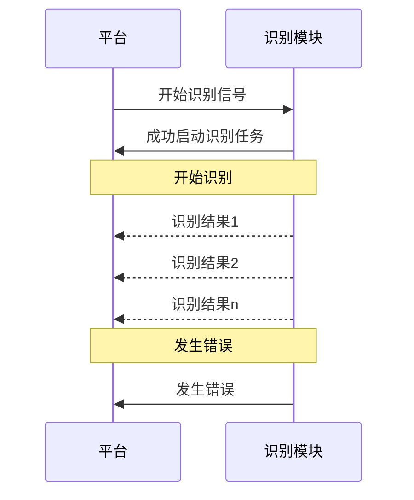

# 1. 交互逻辑

当平台触发开始执行飞行任务（如：定时任务等）时，平台将发送开始识别的信号到 Redis 中。
识别模块需要启动一个 daemonize 服务，并订阅 Redis 中的特定 Channel。当平台发送开始识别的消息到该 Channel 中时，识别模块需要开始从媒体服务器中拉取视频流并启动识别任务。在识别的过程中，识别模块需要对目标进行圈注、标记，encode 为新的视频流，并将带有目标圈注和标记的视频流推送到媒体服务器。并行地，识别模块在识别到特定目标后，需要截取前7秒和后7秒，共14秒1帧的视频数据，保存到特定目录。同时，将结果发送到 Redis 中的特定 Channel。

注意，此处设计到两个 Redis Channel，一个是开始识别和结束识别交互的 Channel，假设其通道名称为：`cloud_uav:channel:recognize:signal` ；另外一个是识别结果的 Channel，假设其通道名称为：`cloud_uav:channel:recognize:result`。

## 1.1. 平台请求识别模块开始识别的交互




# 2. 消息结构定义

## 2.1. 信号

### 2.1.1. 开始识别

| 参数         | 类型                | 必含  | 可空  | 示例值                                    | 说明                                          |
| :--------- | ----------------- | --- | --- | -------------------------------------- | ------------------------------------------- |
| `msg_type` | `signal_msg_type` | 是   | 否   | `start_recognize`                      | 消息类型。该参数的类型为枚举，具体内容请参照下方的 `signal_msg_type` |
| `msg_id`   | `str`             | 是   | 否   | `cd5925d0-8983-4445-bc9b-8700da3a5820` | 消息编号                                        |
| `ts`       | `int`             | 是   | 否   | `1757596521`                           | Unix 时间戳（秒级）                                |
| `payload`  | `payload`         | 是   | 否   |                                        | 消息载荷。该参数的类型为结构体，具体内容请参照下方的 `payload`        |
1. `signal_msg_type` 枚举说明

| 值       | 说明   |
| :------ | :--- |
| `start` | 开始识别 |
| `stop`  | 结束识别 |

2. `payload` 结构体说明

| 参数            | 类型    | 必含  | 可空  | 示例值                                  | 说明    |
| :------------ | :---- | :-- | :-- | :----------------------------------- | :---- |
| `origin_uri`  | `str` | 是   | 否   | `rtsp://127.0.0.1:554/live1`         | 拉流地址  |
| `labeled_uri` | `str` | 是   | 否   | `rtsp://127.0.0.1:554/live1/labeled` | 推流地址  |
| `airport_sn`  | `str` | 是   | 否   |                                      | 机场SN  |
| `vehicle_sn`  | `str` | 是   | 否   |                                      | 飞行器SN |
| `tenant_id`   | `str` | 是   | 否   |                                      | 租户编号  |
| `plan_id`     | `str` | 是   | 否   |                                      | 计划ID  |
| `task_id`     | `str` | 是   | 否   |                                      | 任务ID  |
 > 注意：`payload` 的结构可能不尽全，后续业务实际开发过程可能新增字段，但不会减少字段。

示例：
```bash
redis> PUBLISH cloud_uav:channel:recognize:signal {"msg_type": "start", "msg_id": "cd5925d0-8983-4445-bc9b-8700da3a5820", "ts": 1757596521, "payload": {"pull_uri": "rtsp://127.0.0.1:554/live1", "labeled_uri": "rtsp://127.0.0.1:554/live1/labeled", "airport_sn": "xxxxxx", "vehicle_sn": "yyyyyy", "tenant_id": "aaaaaa", "plan_id": "bbbbbb", "task_id": "cccccc"}}
```
### 2.1.2. 识别响应
当识别模块接收到平台发送的开始识别请求信号后，识别模块需要告知启动识别任务的情况。
> 注意，成功识别不等于完成识别，而是开始识别的准备正确且没有发生错误（如：cv2 open 流没有返回错误），这需要阻塞并持续拉流前发送消息到特定通道（`cloud_uav:channel:recognize:callback`）中。

当正常开始识别时，识别模块需要发送的消息。
或是在识别过程中发生错误，识别模块需要告知平台结束识别。
其消息结构定义如下：

| 参数              | 类型              | 必含  | 可空  | 示例值                                    | 说明                                          |
| :-------------- | --------------- | --- | --- | -------------------------------------- | ------------------------------------------- |
| `callback_type` | `callback_type` | 是   | 否   | `success`                              | 消息类型。该参数的类型为枚举，具体内容请参照下方的 `callback_type`   |
| `msg_id`        | `str`           | 是   | 否   | `cd5925d0-8983-4445-bc9b-8700da3a5820` | 消息编号                                        |
| `ts`            | `int`           | 是   | 否   | `1757596521`                           | Unix 时间戳（秒级）                                |
| `payload`       | `payload`       | 是   | 否   |                                        | 消息载荷。该参数的类型为结构体，具体内容请参照下方的 `payload`        |
| `error_message` | `str`           | 是   | 是   |                                        | 错误消息。当 `callback_type` 为 `error` 时，该参数不可为空。 |

1. `signal_msg_type` 枚举说明

| 值          | 说明               |
| :--------- | ---------------- |
| `success`  | 成功开始识别           |
| `error`    | 开始识别失败或识别过程中发生错误 |
| `complete` | 识别完成。通常不用发送      |
注意，其中的 `msg_id`、`payload` 需要与平台发送到识别模块请求开始识别的消息一致。此外，识别模块需要根据实际情况修改 `callback_type` 的值，`ts` 由识别模块获取当前系统时间戳生成。

2. 示例值
- 成功开始识别的示例

```json
{
	"callback_type": "success",
	"msg_id": "cd5925d0-8983-4445-bc9b-8700da3a5820",
	"ts": 1757596525,
	"payload": {
		"pull_uri": "rtsp://127.0.0.1:554/live1", 
		"labeled_uri": "rtsp://127.0.0.1:554/live1/labeled", 
		"airport_sn": "xxxxxx", 
		"vehicle_sn": "yyyyyy", 
		"tenant_id": "aaaaaa", 
		"plan_id": "bbbbbb", 
		"task_id": "cccccc"
	},
	"error_message": null
}
```

- 开始识别失败或识别过程中发生错误

```json
{
	"callback_type": "error",
	"msg_id": "cd5925d0-8983-4445-bc9b-8700da3a5820",
	"ts": 1757596525,
	"payload": {
		"pull_uri": "rtsp://127.0.0.1:554/live1", 
		"labeled_uri": "rtsp://127.0.0.1:554/live1/labeled", 
		"airport_sn": "xxxxxx", 
		"vehicle_sn": "yyyyyy", 
		"tenant_id": "aaaaaa", 
		"plan_id": "bbbbbb", 
		"task_id": "cccccc"
	},
	"error_message": "failed to open the input stream"
}
```

- 识别完成

```json
{
	"callback_type": "complete",
	"msg_id": "cd5925d0-8983-4445-bc9b-8700da3a5820",
	"ts": 1757596825,
	"payload": {
		"pull_uri": "rtsp://127.0.0.1:554/live1", 
		"labeled_uri": "rtsp://127.0.0.1:554/live1/labeled", 
		"airport_sn": "xxxxxx", 
		"vehicle_sn": "yyyyyy", 
		"tenant_id": "aaaaaa", 
		"plan_id": "bbbbbb", 
		"task_id": "cccccc"
	},
	"error_message": null
}
```
## 2.2. 消息结果
当识别模块在执行识别任务的过程中，发现特定目标后，需要向 Redis 的特定通道发送识别结果。其结构定义如下：

```json
{
	"video_path": "/path/to/short_video.avi", // 短视频路径
	"ts": 1757596725, // 发送该消息时的时间戳
	"meta_info": {
		"msg_id": "cd5925d0-8983-4445-bc9b-8700da3a5820", // 平台请求识别模块开始识别时所发送的消息的msg_id
		"pull_uri": "rtsp://127.0.0.1:554/live1", // 平台请求识别模块开始识别时所发送的消息的 payload.pull_uri
		"labeled_uri": "rtsp://127.0.0.1:554/live1/labeled", // 平台请求识别模块开始识别时所发送的消息的 payload.labeled_uri
		"airport_sn": "xxxxxx", // 平台请求识别模块开始识别时所发送的消息的 payload.airport_sm
		"vehicle_sn": "yyyyyy", // 平台请求识别模块开始识别时所发送的消息的 payload.vehicle_sn
		"tenant_id": "aaaaaa", // 平台请求识别模块开始识别时所发送的消息的 payload.tenant_id
		"plan_id": "bbbbbb", // 平台请求识别模块开始识别时所发送的消息的 payload.plan_id
		"task_id": "cccccc" // 平台请求识别模块开始识别时所发送的消息的 payload.task_id
	},
	"results": [
		{
			"target_class": "car", // 目标类型。car - 车；human - 人; landslit - 山体滑坡/垮塌/坍塌
			"frame_ts": 1757596718001, // 检测到该目标时的帧的毫秒级时间戳
			"box": {
				"x_1": 60, // 左上角距离画面左侧的像素点偏移
				"y_1": 60, // 左上角距离画面上侧的像素点偏移
				"x_2": 120, // 右下角距离画面左侧的像素点偏移
				"y_2": 120, // 右下角距离画面上侧的像素点偏移
			},
			"position": {
				"latitude": 25.070270, // 目标中心点的纬度
				"longitude": 102.684488, // 目标中心点的经度
				"altitude": 1920.12, // 可空。目标中心点的海拔（如无法获取，请传递 null ）
			},
			"conf": 0.98, // 置信度
			"track_id": 1, // 可空。当使用 track 算法时的track_id
			"vehicle_info": { // 发现目标时那一帧的飞行器信息，这通常只需要从 Redis 中远洋取出并放入该消息中即可
				"vehicle": {
					"roll": 30,
					"pitch": 45,
					"yaw": 60,
					"latitude": 25.070270,
					"longitude": 102.684488,
					"altitude": 1920.12,
				},
				"gimbal": {
					"roll": 30,
					"pitch": 45,
					"yaw": 60
				},
				// ... 可能存在其他参数
			}
		}
	]
}
```
